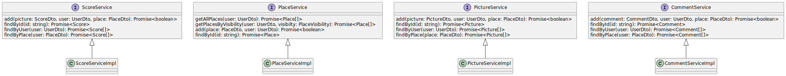
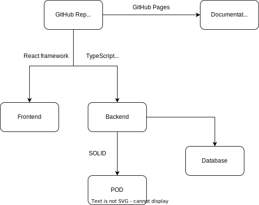

[[section-system-scope-and-context]]
== System Scope and Context
In this chapter we will give a brief description of what will the scope of the project be, as well as for which context it is being created for.

The project is aimed at creating a software system for decentralized maps, where users can store their shared information in SOLID Pods. The application will be able to retrieve that data (given the permission from the user), and use it to display whatever markers the user might want to add.

== Business Context
The system is related with several parters, shown in the following diagram:

The elements shown in the diagram are explained here:

[options="header,footer"]
|=======================
|Partner          |Input             |Output
|User             |Application services |User data
|POD              |User data/request |User data
|LoMap            |User input        |Service to user
|(DataBase)       |User data request |User data
|(Image service)  |Image request     |Images
|(Map service)    |Map data request  |Map data 
|=======================

=== Technical Context

The system's structure consists in the following components:

Each component will be explained in more detail:

[options="header,footer"]
|=======================
|Technical component   |Description
|GitHub Repository     |Repository storing the code and documentation of the project
|Documentation         |Text files explaining the system's architecture following the arc42 template
|Frontend              |System parts that handle the interaction with the user through the user interface
|Backend               |System parts that handle the data processing logic
|DataBase              |Persistent storage system to store the system's data
|SOLID                 |Architecture providing a way to store the user data in a decentralized and remote way
|POD                   |Each different, decentralized data repositories used by SOLID to store a single user's information
|=======================