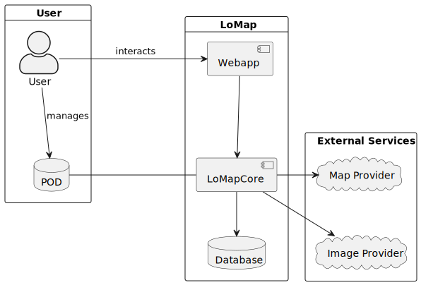

[[section-building-block-view]]

== Building Block View

=== Whitebox Overall System

This is a high-level static overview of the system and all its building blocks. It shows the application components, the user-related components and the external services that the application uses.

The main actor for the application is the user, which interacts with the application and provides access to a POD on which its data is stored. The application is divided into the frontend –managing the user interaction–, and backend which interacts with external services.

This diagram is divided based on data ownership. Three main groups are considered:

- User: groups all user-related blocks.
- LoMap: groups all application-specific blocks.
- External Services: groups all other blocks that are not directly related to the user nor to the application.

==== Contained BlackBoxes
[options="header"]
|===========================================================================================================
| Name            | Description                                                                                      
| User            | External user that provides its data through a POD and that makes use of the application services
| POD             | Privately holds all user data. The application asks for permission to access this information    
| Webapp          | Provides an user-friendly interface to access all application services                           
| LoMapCore       | Provides the services that the application offers. Connects to data sources to provide those services
| Database        | Holds all common data that the application needs to run
| Map Provider    | External service that provides map data to the application
| Image Provider  | External service that provides image data to the application
|===========================================================================================================

=== Level 1: Webapp
The Webapp encompasses all UI-related components of the application. ...

(insert diagram)

==== Contained BlackBoxes
[options="header"]
|===
| Name            | Responsibility
| Comp1   | Component 1 of the Webapp
| Comp2   | Component 2 of the Webapp
| Comp3   | Component 3 of the Webapp
| ... | ...
|===

==== Level 1: LoMapCore
The LoMapCore block encompasses all business-logic components, as well as data-source management and interaction with other services. ...

(insert diagram)

==== Contained BlackBoxes
[options="header"]
|===
| Name            | Responsibility
| RestAPI   | API that allows all the other parts of the application to connect to the LoMapCore
| Comp2   | Component 2 of the RestAPI
| Comp3   | Component 3 of the RestAPI
| ... | ...
|===

==== Database
The Database holds all common information that the application needs to run, such as cached data, ???, ...

TODO: Is it necessary to include a diagram for the Database?

==== <Name interface 1>

...

==== <Name interface m>

=== Level 2

[role="arc42help"]
****
Here you can specify the inner structure of (some) building blocks from level 1 as white boxes.

You have to decide which building blocks of your system are important enough to justify such a detailed description.
Please prefer relevance over completeness. Specify important, surprising, risky, complex or volatile building blocks.
Leave out normal, simple, boring or standardized parts of your system
****

==== White Box _<building block 1>_

[role="arc42help"]
****
...describes the internal structure of _building block 1_.
****

_<white box template>_

==== White Box _<building block 2>_

_<white box template>_

...

==== White Box _<building block m>_

_<white box template>_

=== Level 3

[role="arc42help"]
****
Here you can specify the inner structure of (some) building blocks from level 2 as white boxes.

When you need more detailed levels of your architecture please copy this
part of arc42 for additional levels.
****

==== White Box <_building block x.1_>

[role="arc42help"]
****
Specifies the internal structure of _building block x.1_.
****

_<white box template>_

==== White Box <_building block x.2_>

_<white box template>_

==== White Box <_building block y.1_>

_<white box template>_
